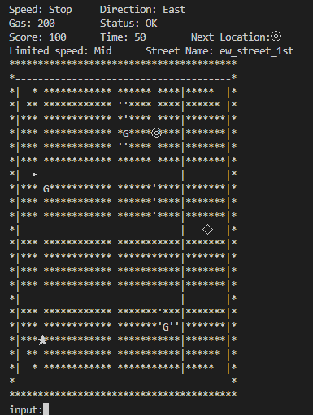

# cpp-01-project-ja

# ビルド方法
ディレクトリ**cpp-01-project-ja\src**で下記コマンドを実行 

>g++ --std=c++17 main.cpp display.cpp map.cpp car.cpp  env.cpp -o main.exe

## 実行方法
1. 60文字30行以上表示できるようにコンソールを設定する。
2. **main.exe**を実行する

# プログラム内容
## 操作方法
**input:** の後にコマンドを入力し、Enterキーを押下する。 
* accelerate 
自車が一段ずつ加速する。最大Highまで加速する。
* decelerate 
自車が一段ずつ加速する。最低stopまで減速する。
* turn left 
自車の進行方向が左に90度回る。 
速度による動作の違いはを参照。
* turn right 
自車の進行方向が右に90度回る。
速度による動作の違いはを参照。
* continue straight 
現在の方向に、現在の速度で移動する。
* exit 
プログラムを終了する。
* stop 
強制的に現在位置に停止する。
* w (accelerateと同じ) 
自車が一段ずつ加速する。最大Highまで加速する。
* s (decelerateと同じ) 
自車が一段ずつ加速する。最低stopまで減速する。
* a (turn leftと同じ) 
自車の進行方向が左に90度回る。
* d (turn rightと同じ) 
自車の進行方向が右に90度回る。
* ”無入力” (continue straightと同じ) 
現在の方向に、現在の速度で移動する。
* e (stopと同じ) 
強制的に現在位置に停止する。
* その他のコマンド
現在の方向に、現在の速度で移動する。
## 画面説明
 
### ステータス画面
* Speed 
現在の速度 (High > Mid > Low > Stop)
* Direction 
現在の進行方向 (North：上,　East：右,　South：下,　West：左)
* Gas 
残りの燃料 (最大200)
* Status 
現在の車両状態 (OK, Speeding：速度違反, Collision：衝突)
* Score 
現在のスコア
* Time 
残り時間。コマンドを入力する毎に減少する。
* Score 
現在のスコア
* Next Location 
次の目的地 (◎, ◇, ★)
* Limited speed 
現在位置の速度制限値 (High > Mid > Low)
* Street Name 
現在位置の名称
### 地図画面
*　"▲" ,　"▶" ,　"▼" ,　"◀" 
自車。それぞれ、自車方向の上、右、下、左に該当する。
* " * " 
進入不可エリア。進入する挙動をすると、衝突してスコアが低下する。
* "空白"(一部を除く) 
通常の道路。制限速度はMidまで。
* " ' "(一部を除く) 
狭路。制限速度はLowまで。
* " - " , " ｜ " ,  "空白"(一部) 
高速道路。制限速度はHighまで。停止するとスコアが低下する。 
画面隅にある"-" , "｜"周辺の"空白"は高速道路扱い。
* G 
ガソリンスタンド。 
その場で停止すると、燃料が満タンになる。残り時間が低下する。
* "◎" , "◇" , "★" 
目的地。 
指定した目的地の上で停止すると、目的地に着いたことになり、新しい目的地が設定される。
## ルール説明
* ゲーム終了条件

|終了条件|
| ---- |
|スコアが0になる |
|ガソリンが0になる|
|残り時間が0になる|
|"exit"を入力する|

* 直進 

| 速度 |　挙動 |
| ---- | ---- |
| stop |  その場で停止|
|Low|進行方向に1マス進む|
|Mid|進行方向に2マス進む|
|High|進行方向に3マス進む|

* カーブ 

| 速度 |　挙動 |
| ---- | ---- |
| stop |  その場で入力した方向に90度回る|
|Low|入力した方向に90度回り1マス進む|
|Mid|元の方向に1マス進み、入力した方向に90度回り1マス進む|
|High|元の方向に1マス進み、入力した方向に90度回り1マス進む挙動を2回行う|

* ガソリン増減 

|  |　増減量 |
| ---- | ---- |
|初期値|200|
|速度：Stop |0|
|速度：Low|-1|
|速度：Mid|-3|
|速度：High|-6|
|燃料補給|200になる|

* スコア増減 

|  |　増減量 |
| ---- | ---- |
| 初期値 |100|
|目的地到着|残り時間と残りガソリン量で増加|
|速度超過|-10|
|衝突|-30|

* 残り時間 

|  |　増減量 |
| ---- | ---- |
| 初期値 |50|
|目的地到着|50に設定|
|コマンド入力|-1|
|燃料補給|-5|

* 衝突 
"*"のセルに進入する挙動を行うと衝突になる。 
衝突した場合は、その場で停止する

* 速度違反 

| 制限速度 |　条件 |
| ---- | ---- |
|Low|速度がMiDもしくはHigh|
|Mid|速度がHigh|
|High|速度がStop|

# プログラム設計

## 基本方針
* グローバル変数は使用せず、コンポーネント間のやり取りは各コンポーネントで用意する関数を利用する。 
⇒変数のスコープを狭くして、管理しやすくするため。また、変更時に影響箇所を限定するため。

## ファイル構成
|ファイル名|主な役割|
| ---- | ---- |
|main.cpp|各コンポーネントの初期化とメインループでプログラムを動作させる。必要に応じてプログラムの終了処理を行う。|
|common.h|各コンポーネント間でやり取りを行うメッセージを定義されている。|
|display.cpp & h|地図情報と自車情報から、画面描画を行う。|
|car.cpp & h|ユーザの入力処理を行い、それに応じた自車情報を演算する|
|env.cpp & h|地図情報と自車情報から、残り時間やスコアを演算する。 終了処理に必要な情報情報を演算する。|
|map.cpp & h|基本地図の作成を行い、基本地図と自車位置を合わせて地図を完成させる。|
## 各ファイルの重要設計
### main.cpp
各コンポーネントの初期化とメインループ内での各コンポーネントのupdate関数の実行と終了処理に特化させている。
### common.h
メッセージの定義のみ。
### display.cpp & h
描画処理を一元管理している。 
car, env, mapから表示する情報を集約して、描画する。 
地図のみ描画関数がmap.cpp & hに存在しており、その関数をコールするだけになっている。 
### car.cpp & h
自車挙動を一元管理している。 
主なコマンドが自車挙動に関係するものであるため、ユーザ入力はここで管理している。 
mapから専用関数で自車位置の進入可否を受けとり、移動処理を行っている。 
他のコンポーネントから自車情報の変更は、燃料補給のみとなっており、専用関数をenvでコールする形で実現している。 
### env.cpp & h
car.cppとmap.cppの情報を専用関数で取得し、自車の地図上の位置によって起こる各種イベントを管理している。 
### map.cpp & h
地図情報を2次元arrayで格納している。 
2次元arrayは表示サイズよりも自車の最大移動分だけ大きく設定することで、 
領域外アクセスを起こさないようにしている。(設計変更で不要になった) 
この2次元arrayに情報を書き込むための各種関数を用意しているので、その組み合わせで地図を作成できる。 
mapのみ専用の描画関数を持っており、地図情報に格納された各ポイントのマークを描画する。 
その際に、carから自車の位置と方向情報を専用関数で取得し、地図情報の一つとして描画する。 
自車のみ動的情報で、その他の地図情報は初期化時に用意された静的なものとなっている。 